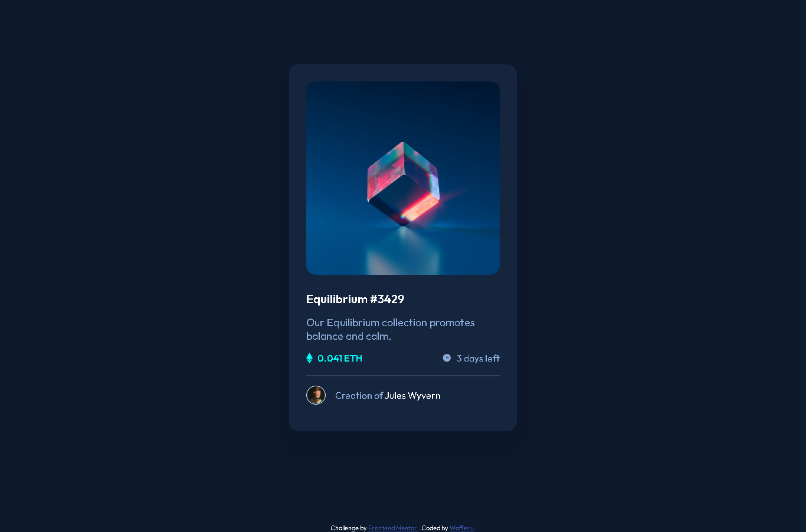

# Frontend Mentor - NFT preview card component solution

This is a solution to the [NFT preview card component challenge on Frontend Mentor](https://www.frontendmentor.io/challenges/nft-preview-card-component-SbdUL_w0U). Frontend Mentor challenges help you improve your coding skills by building realistic projects.

## Table of contents

- [Overview](#overview)
  - [The challenge](#the-challenge)
  - [Screenshot](#screenshot)
  - [Links](#links)
- [My process](#my-process)
  - [Built with](#built-with)
  - [What I learned](#what-i-learned)
  - [Continued development](#continued-development)
  - [Useful resources](#useful-resources)
- [Author](#author)

## Overview

### The challenge

Users should be able to:

- View the optimal layout depending on their device's screen size
- See hover states for interactive elements

### Screenshot



### Links

- Solution URL: [Solution URL](https://www.frontendmentor.io/solutions/nft-preview-card-component-by-wafferu-LylqXY8qTJ)
- Live Site URL: [Live Site URL](https://chipper-faloodeh-64c581.netlify.app/)

## My process

First, I created the HTMl structure. Then, I styled the page. Add some hover styles then work on the responsiveness of the website.

### Built with

- Semantic HTML5 markup
- CSS custom properties
- Flexbox
- Webpage-first workflow

### What I learned

I learned some because of this codes:

```html
<div class="nftPccBox">
  
  <div class="view-overlay">
    
  </div>
</div>
```

```css
.view-overlay {
  position: absolute;
  top: 0;
  bottom: 0;
  left: 0;
  right: 0;
  opacity: 0;
  height: 20.661rem;
  width: 20.499rem;
  border-radius: 1rem;
  padding: 8rem;
  background-color: hsl(178, 100%, 50%, 50%);
}

.nftPccBox:first-child:hover .view-overlay {
  opacity: 1;
  cursor: pointer;
}

.nftPccCon {
  display: inline-flex;
  align-items: center;
}

.avatarBox {
  padding: 1rem 0;
  display: flex;
  align-items: center;
}
```

### Continued development

I need to focus on the how to style faster because for me now, it takes a lot of time just to style what I want in my mind. So I will take challenges like this more for me to be comfortable with styling.

### Useful resources

- [Example resource 1](https://www.w3schools.com/howto/howto_css_center-vertical.asp) - This helped me for centering contents inside div tags.
- [Example resource 2](https://www.w3schools.com/howto/howto_css_image_overlay.asp) - I just learned how to do this today. So it helps me a lot on this project.

## Author

- Frontend Mentor - [@wafferu](https://www.frontendmentor.io/profile/wafferu)
